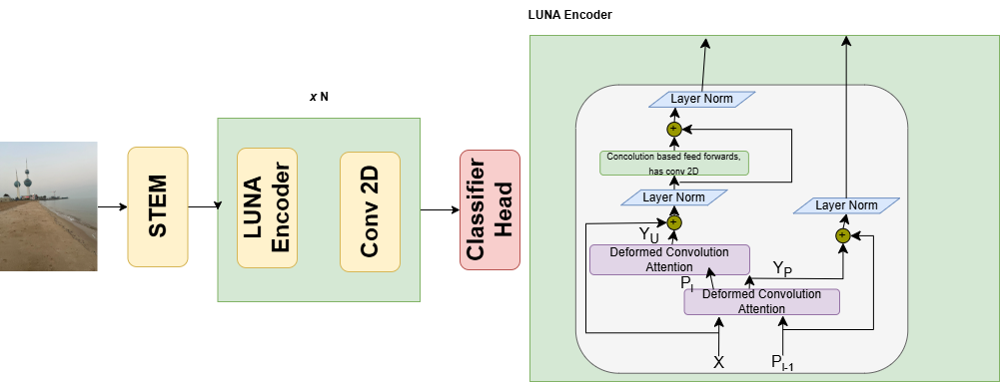
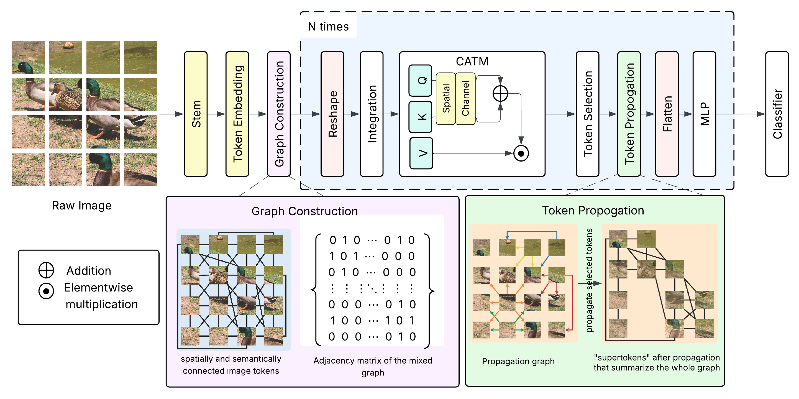

This repository contains all the expriments for the Visual and Mobile computing project on Efficient ViT: Training and inference.

The folders correspond to different experiments conducted

The conda enviroment can be activated from the environment.yml present

The dataset used is IMageNet-200, can be obtained from IMageNet -1K using the data_cookbook script, The actual dataset will be uploaded soon as well.

The dataset format expected is as follows: 

train/
├── class_1/
│   ├── img1.png
│   └── img2.png
├── class_2/
│   ├── img1.png
│   └── img2.png

The architecture for NDMA-CAS-ViT is as follows:

The architecture of GTP-CAS-ViT is as follows:

The code for training these can be run from the main.py file in the respective folders.